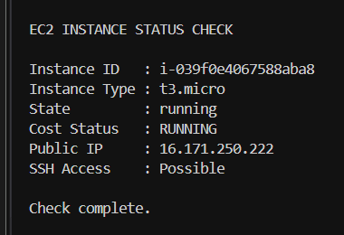
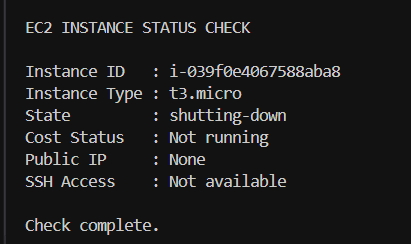

# ec2_monitor_py


EC2 monitor is a Python script that uses boto3 (AWS SDK for Python) to inspect EC2 instances in your AWS account and print key details such as Instance ID, Instance Type, State, Public IP, and basic cost-risk visibility based on whether the instance is running. The script is read-only and does not create, modify, or delete AWS resources.

Screenshot 1:



Screenshot 2:




## What It Does
- Calls the EC2 DescribeInstances API
- Prints InstanceId, InstanceType, and State for each instance found
- Shows a cost-risk hint by flagging running instances
- Checks whether a Public IP exists to indicate potential SSH reachability
## Requirements
- Python 3
- boto3 installed
- AWS credentials and default region configured locally (AWS CLI profile or environment credentials)
## IAM Permissions
Minimum required permission:
```json
{
  "Version": "2012-10-17",
  "Statement": [
    {
      "Effect": "Allow",
      "Action": [
        "ec2:DescribeInstances"
      ],
      "Resource": "*"
    }
  ]
}
```

# Run:
python -m ec2_monitor_py


